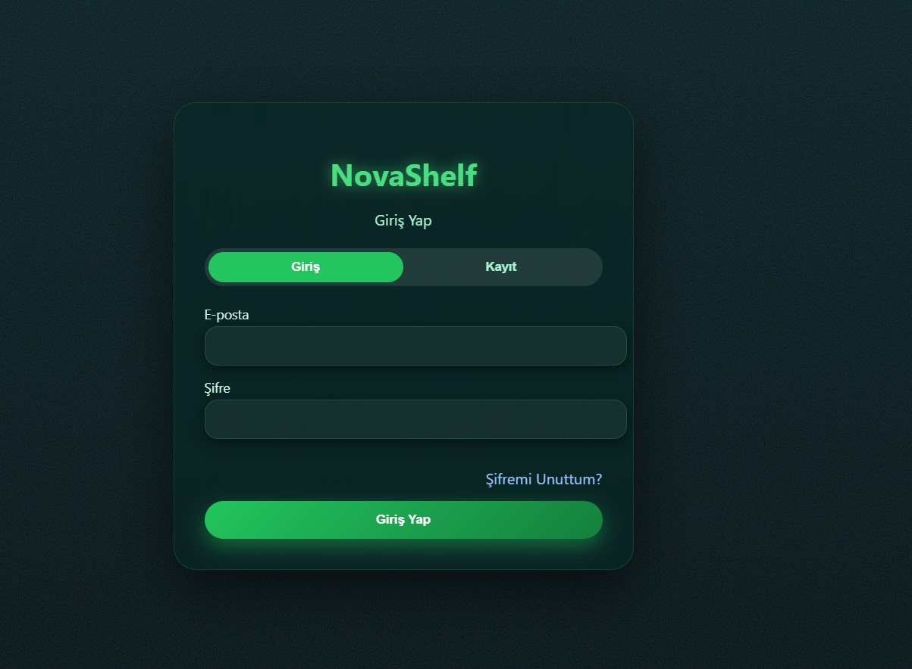
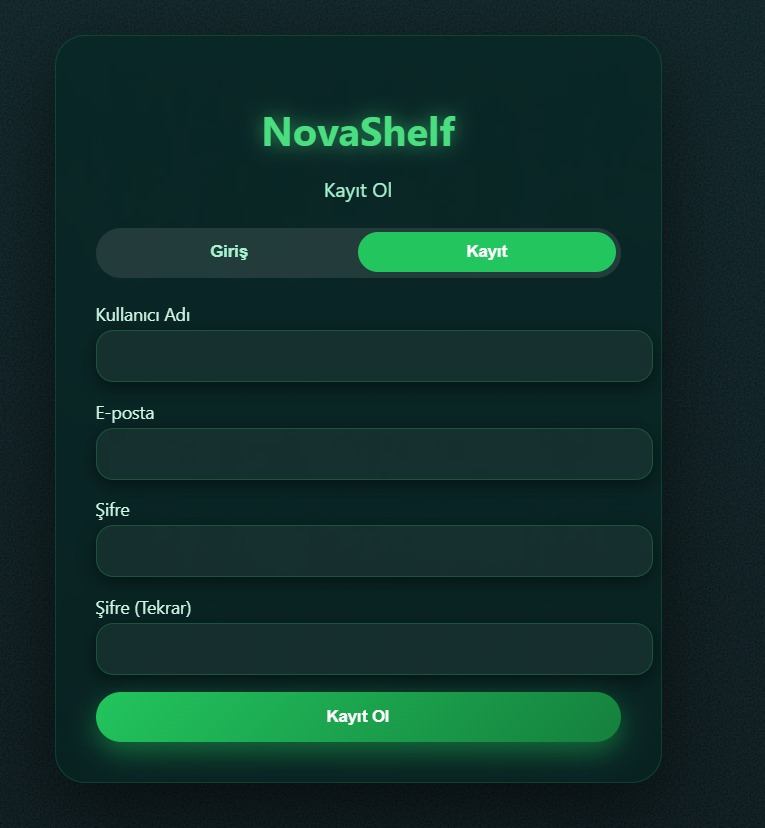
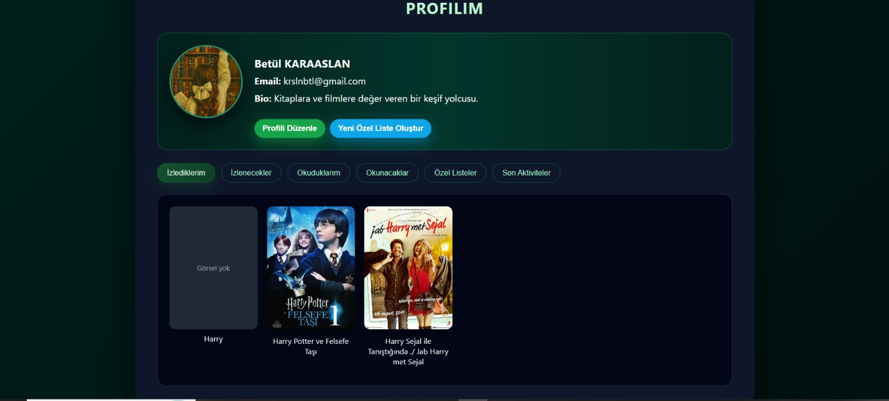
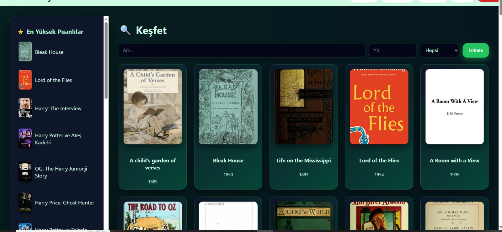
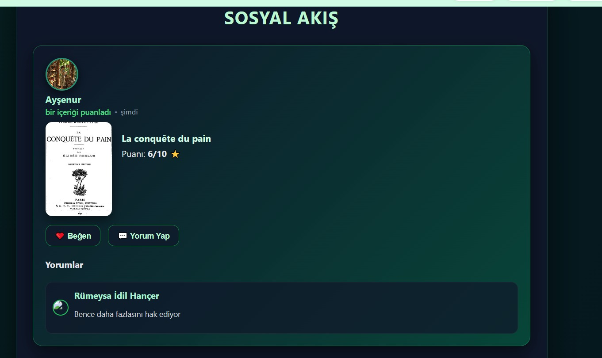
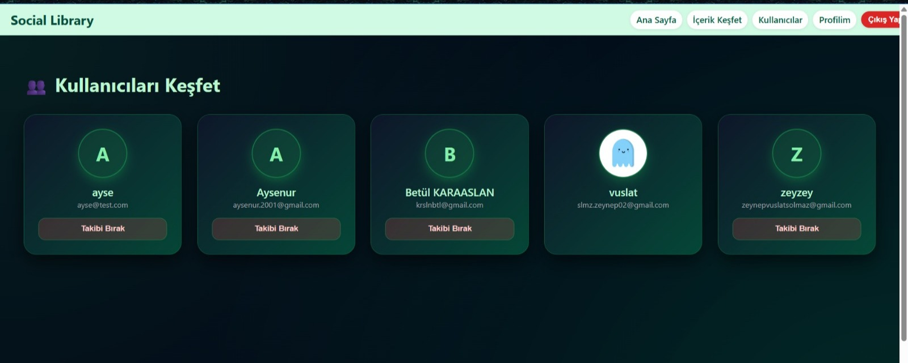

# Social_Library
DİNAMİK SINAV TAKVİMİ VE OTURMA PLANI SİSTEMİ
Dynamic Exam Scheduling and Seating Plan System
================================================

====================
TÜRKÇE
====================

PROJE TANIMI
Bu proje, üniversite genelinde sınavların adil, çakışmasız ve verimli
şekilde planlanmasını amaçlayan PyQt6 tabanlı bir masaüstü uygulamasıdır.

Sistem; dersler, öğrenciler, öğretim elemanları ve derslikleri birlikte
ele alarak sınav takvimini otomatik üretir ve her sınav için derslik
bazlı oturma planları oluşturur. Uygulama, manuel planlamada sıkça
karşılaşılan öğrenci çakışmaları, kapasite yetersizlikleri ve dengesiz
dağılım problemlerini otomatik algoritmalarla çözer.

PROJENİN AMAÇLARI
- Öğrencilerin aynı anda birden fazla sınava girmesini önlemek
- Derslik kapasitesini en verimli şekilde kullanmak
- Sınavları gün ve saatlere dengeli biçimde dağıtmak
- Otomatik ve görsel olarak anlaşılır sınav programları üretmek
- Oturma düzenlerini derslik bazlı ve düzenli şekilde oluşturmak
- PDF ve Excel çıktılarıyla idari süreçleri kolaylaştırmak

KULLANILAN YÖNTEM VE ALGORİTMALAR
- Dersler arası ilişkiler çakışma grafı (conflict graph) ile modellenmiştir
- Graf boyama (graph coloring) yaklaşımı ile sınav slot ataması yapılmıştır
- Dersler; öğrenci sayısı ve çakışma derecesine göre önceliklendirilmiştir
- Derslikler kapasite ve fiziksel düzenlerine göre otomatik atanmıştır
- Her sınav için derslik bazlı oturma planı oluşturulmuştur
- Çakışma, kapasite aşımı ve yasaklı günler otomatik kontrol edilmiştir

UYGULAMA ÖZELLİKLERİ
- PyQt6 ile geliştirilmiş modern masaüstü arayüz
- Kullanıcı giriş sistemi (Admin / Koordinatör)
- Excel üzerinden ders ve öğrenci listesi yükleme
- Takvim ve tablo tabanlı sınav programı görünümü
- Çakışma ve istisna yönetimi (detaylı hata raporları)
- Derslik bazlı etkileşimli oturma planı görselleştirmesi
- PDF ve Excel çıktı alma desteği
- Hata, uyarı ve log paneli

KULLANILAN TEKNOLOJİLER
- Python 3
- PyQt6
- Pandas
- NetworkX
- SQL / MSSQL
- Excel ve PDF çıktı araçları

PROJE YAPISI
sinavprogrami/
- app.py              : Ana uygulama
- auth.py             : Kullanıcı doğrulama
- login.py            : Giriş işlemleri
- login_dialog.py     : Giriş arayüzü
- main_window.py      : Ana pencere
- dp.py               : Planlama algoritmaları
- dp_check.py         : Çakışma ve kısıt kontrolleri
- SQLQuery.sql        : Veritabanı sorguları
- DersListesi.xlsx    : Örnek veri dosyası
- screenshots/        : README görselleri

NASIL ÇALIŞTIRILIR
1) Gerekli kütüphaneleri yükleyin:
pip install pyqt6 pandas networkx

2) Uygulamayı başlatın:
python app.py

3) Kullanım adımları:
- Uygulamayı başlatın
- Admin veya yetkili kullanıcı ile giriş yapın
- Excel dosyaları ile ders ve öğrenci verilerini yükleyin
- Sınav tarihleri, türü ve süre kısıtlarını belirleyin
- “Programı Oluştur” butonuna basın
- Sınav takvimini ve oturma planlarını inceleyin
- PDF veya Excel çıktısı alın

UYGULAMA EKRAN GÖRÜNTÜLERİ

Genel Uygulama Önizleme

Çakışma ve İstisna Yönetimi

Oturma Düzeni ve Derslik Yerleşimi

GELİŞTİRİCİLER
- Zeynep Vuslat Solmaz
- Ayşenur Karaaslan

====================
ENGLISH
====================

PROJECT DESCRIPTION
This project is a PyQt6-based desktop application designed to generate
fair, conflict-free, and optimized exam schedules at the university level.

The system automatically creates exam timetables by considering courses,
students, instructors, and classrooms together. It also generates
classroom-based seating plans for each exam, eliminating manual scheduling
errors such as student conflicts and capacity issues.

PROJECT OBJECTIVES
- Prevent students from having overlapping exams
- Optimize classroom capacity usage
- Distribute exams evenly across days and time slots
- Automatically generate clear and structured exam schedules
- Create classroom-based seating arrangements
- Export results as PDF and Excel files

METHODS AND ALGORITHMS
- Course relationships are modeled using a conflict graph
- Exam time slots are assigned using graph coloring techniques
- Courses are prioritized based on student count and conflict degree
- Classrooms are assigned according to capacity and layout
- Seating plans are generated for each classroom
- Constraint violations are automatically detected and reported

FEATURES
- Modern desktop GUI developed with PyQt6
- User authentication system (Admin / Coordinator)
- Excel-based bulk data import
- Calendar and table-based exam schedule view
- Detailed conflict and exception management
- Interactive seating plan visualization
- PDF and Excel export support
- Error and warning reporting panel

TECHNOLOGIES
- Python 3
- PyQt6
- Pandas
- NetworkX
- SQL / MSSQL
- Excel and PDF export tools

HOW TO RUN
1) Install dependencies:
pip install pyqt6 pandas networkx

2) Run the application:
python app.py

3) Workflow:
- Launch the application
- Log in as an authorized user
- Import course and student data via Excel
- Define exam dates, types, and constraints
- Click “Generate Schedule”
- Review exam timetable and seating plans
- Export outputs as PDF or Excel

SCREENSHOTS

Application Overview

Conflict and Exception Management

Seating Plan Visualization

DEVELOPERS
- Zeynep Vuslat Solmaz
- Ayşenur Karaaslan

NOTE
This project was developed for academic and portfolio purposes and can be
extended with additional optimization constraints and reporting features.
====================
SOSYAL KÜTÜPHANE PLATFORMU – EKRAN GÖRÜNTÜLERİ
====================

Giriş Ekranı
------------
Kullanıcıların e-posta ve şifre ile sisteme giriş yapabildiği,
modern ve karanlık temalı giriş arayüzü.

Kayıt Olma Ekranı
----------------
Yeni kullanıcıların hesap oluşturabildiği,
şifre doğrulamalı kayıt ekranı.

Kullanıcı Profili
-----------------
Kullanıcının okuduğu / izlediği içerikleri, özel listelerini
ve son aktivitelerini görüntüleyebildiği profil sayfası.

İçerik Keşfet
-------------
Kitap ve filmlerin harici API’lerden alınarak listelendiği,
filtreleme ve arama özelliklerine sahip keşfet sayfası.

Sosyal Akış
-----------
Kullanıcıların puanlama, yorum ve listeleme aktivitelerinin
kart yapılarıyla sunulduğu sosyal akış ekranı.

Kullanıcıları Keşfet
-------------------
Diğer kullanıcıların listelendiği, takip et / takibi bırak
özelliklerini içeren kullanıcı keşfet ekranı.

