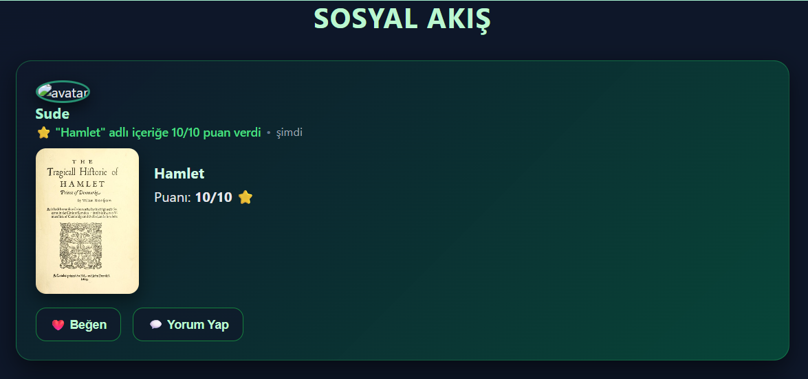
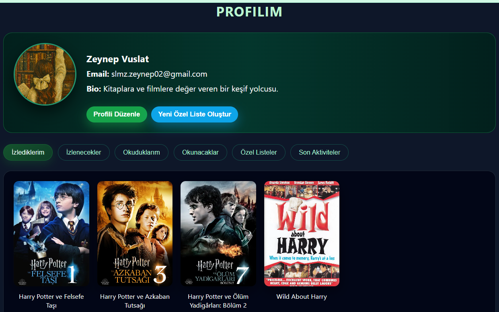
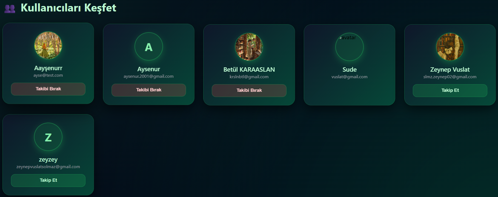
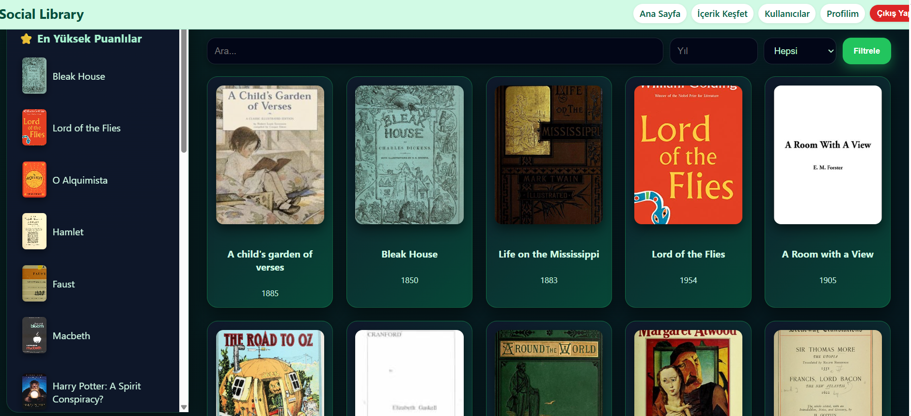

# NovaShelf — Social Library 📚🎬


Kişisel kütüphane yönetimi ile sosyal medya deneyimini birleştiren, **React** tabanlı frontend ve **Node.js/Express** tabanlı backend ile geliştirilmiş web tabanlı bir platform.
A web-based platform built with a **React** frontend and a **Node.js/Express** backend, combining personal library management with a social media experience.

---

## 🇹🇷 Türkçe

### Proje Hakkında

Bu proje, kullanıcıların kitap ve film içeriklerini kişisel kütüphanelerinde takip edebildiği, puanlayabildiği, yorumlayabildiği ve sosyal bir akış üzerinden etkileşime girebildiği web tabanlı bir sosyal platformdur.

Sistem, kullanıcı aktivitelerini dinamik bir akışta toplayarak; puanlama, yorum yapma ve listeye ekleme gibi eylemleri görsel açıdan zengin kart bileşenleriyle sunar. Platform, içerik meta verilerini manuel giriş gerektirmeden harici API kaynaklarından (**TMDb**, **Google Books**, **Open Library**) alarak veri bütünlüğünü ve içerik çeşitliliğini artırır.

Kocaeli Üniversitesi Bilgisayar Mühendisliği — Yazılım Laboratuvarı I dersi kapsamında geliştirilmiştir.

### 📸 Ekran Görüntüleri

| Sosyal Akış | Profil |
|---|---|
|  |  |

| Kullanıcıları Keşfet | İçerik Keşfet |
|---|---|
|  |  |

### ✨ Özellikler

- 🔐 JWT tabanlı kullanıcı kimlik doğrulama ve yetkilendirme
- 📖 Kitap ve film içeriklerini harici API'lerden (TMDb, Google Books, Open Library) dinamik olarak çekme
- ⭐ İçerik puanlama ve yorum yapma
- 💬 Yorumlara cevap verme ve beğenme
- 📋 Kişisel özel listeler oluşturma (izlenecekler, okunacaklar vb.)
- 🔄 Kullanıcı takip sistemi ve sosyal aktivite akışı (feed)
- 🔍 Gelişmiş arama ve keşfet modülü (filtreleme desteğiyle)
- 👤 Kişiselleştirilebilir profil sayfası

### 🛠️ Teknoloji Yığını

| Katman | Teknoloji |
|---|---|
| Frontend | React (Vite) |
| Backend | Node.js — Express |
| Veritabanı | Microsoft SQL Server |
| Kimlik Doğrulama | JWT (JSON Web Token) |
| Harici API'ler | TMDb, Google Books, Open Library |

### 📁 Proje Yapısı

```
web/
├── app.js                  # Express giriş noktası
├── config/
│   └── db.js                # Veritabanı bağlantısı
├── middleware/
│   └── authMiddleware.js    # JWT doğrulama middleware'i
├── routes/                  # API endpoint'leri
│   ├── auth.js
│   ├── contents.js
│   ├── feed.js
│   ├── follows.js
│   ├── movies.js
│   ├── protected.js
│   └── users.js
└── client/                   # Frontend (React + Vite)
    └── src/
        ├── components/       # Tekrar kullanılan bileşenler (Navbar, Layout)
        ├── pages/            # Sayfa bileşenleri (Feed, Profil, Keşfet vb.)
        └── utils/            # Yardımcı fonksiyonlar
```

### 🚀 Kurulum

**Gereksinimler:** Node.js, npm, Microsoft SQL Server

1. Depoyu klonlayın:
   ```bash
   git clone https://github.com/zvsolmaz/Social_Library.git
   cd Social_Library/webuygulamasi/web
   ```

2. Backend bağımlılıklarını yükleyin:
   ```bash
   npm install
   ```

3. Kök dizinde bir `.env` dosyası oluşturun ve aşağıdaki değişkenleri tanımlayın:
   ```
   DB_SERVER=localhost\SQLEXPRESS
   DB_USER=sa
   DB_PASSWORD=your_password
   DB_NAME=WebUygulamasi
   JWT_SECRET=your_jwt_secret
   MAIL_USER=your_email
   MAIL_PASS=your_app_password
   TMDB_API_KEY=your_tmdb_key
   FRONTEND_URL=http://localhost:5173
   ```

4. Backend'i başlatın:
   ```bash
   npm start
   ```

5. Frontend bağımlılıklarını yükleyin ve başlatın:
   ```bash
   cd client
   npm install
   ```
   `client/.env.local` dosyası oluşturup şunu ekleyin:
   ```
   VITE_API_URL=http://localhost:5001
   ```
   Sonra:
   ```bash
   npm run dev
   ```

6. Tarayıcıda `http://localhost:5173` adresine gidin.

### 👥 Katkıda Bulunanlar

Bu proje kapsamında yer alan kodların geliştirilmesi ve düzenlenmesi sürecinde **Ayşenur Karaaslan** ve **Zeynep Vuslat Solmaz** birlikte çalışmıştır. Kod yazımı, hata ayıklama ve algoritmaların uygulanması gibi tüm teknik aşamalar ortak bir çabayla gerçekleştirilmiştir.

- **Ayşenur Karaaslan**
- **Zeynep Vuslat Solmaz**

### 📄 Lisans

Bu proje eğitim amaçlı geliştirilmiştir (Kocaeli Üniversitesi, Yazılım Laboratuvarı I).

---

## 🇬🇧 English

### About the Project

This project is a web-based social platform that allows users to track, rate, and review book and film content in their personal libraries, and interact with each other through a social activity feed.

The system aggregates user activities into a dynamic feed, presenting actions such as rating, reviewing, and adding items to lists through visually rich card components. The platform enriches content metadata by fetching it automatically from external APIs (**TMDb**, **Google Books**, **Open Library**), removing the need for manual data entry and improving content diversity.

Developed as part of the Software Laboratory I course at Kocaeli University, Department of Computer Engineering.

### 📸 Screenshots

| Social Feed | Profile |
|---|---|
|  |  |

| Discover Users | Explore Content |
|---|---|
|  |  |

### ✨ Features

- 🔐 JWT-based user authentication and authorization
- 📖 Dynamic fetching of book and movie data from external APIs (TMDb, Google Books, Open Library)
- ⭐ Content rating and reviewing
- 💬 Replying to and liking reviews
- 📋 Creating personal custom lists (to-watch, to-read, etc.)
- 🔄 User follow system and social activity feed
- 🔍 Advanced search and explore module with filtering
- 👤 Customizable user profile page

### 🛠️ Tech Stack

| Layer | Technology |
|---|---|
| Frontend | React (Vite) |
| Backend | Node.js — Express |
| Database | Microsoft SQL Server |
| Authentication | JWT (JSON Web Token) |
| External APIs | TMDb, Google Books, Open Library |

### 📁 Project Structure

```
web/
├── app.js                  # Express entry point
├── config/
│   └── db.js                # Database connection
├── middleware/
│   └── authMiddleware.js    # JWT verification middleware
├── routes/                  # API endpoints
│   ├── auth.js
│   ├── contents.js
│   ├── feed.js
│   ├── follows.js
│   ├── movies.js
│   ├── protected.js
│   └── users.js
└── client/                   # Frontend (React + Vite)
    └── src/
        ├── components/       # Reusable components (Navbar, Layout)
        ├── pages/            # Page components (Feed, Profile, Explore, etc.)
        └── utils/            # Helper functions
```

### 🚀 Getting Started

**Requirements:** Node.js, npm, Microsoft SQL Server

1. Clone the repository:
   ```bash
   git clone https://github.com/zvsolmaz/Social_Library.git
   cd Social_Library/webuygulamasi/web
   ```

2. Install backend dependencies:
   ```bash
   npm install
   ```

3. Create a `.env` file in the root directory with the following variables:
   ```
   DB_SERVER=localhost\SQLEXPRESS
   DB_USER=sa
   DB_PASSWORD=your_password
   DB_NAME=WebUygulamasi
   JWT_SECRET=your_jwt_secret
   MAIL_USER=your_email
   MAIL_PASS=your_app_password
   TMDB_API_KEY=your_tmdb_key
   FRONTEND_URL=http://localhost:5173
   ```

4. Start the backend:
   ```bash
   npm start
   ```

5. Install frontend dependencies and start it:
   ```bash
   cd client
   npm install
   ```
   Create a `client/.env.local` file with:
   ```
   VITE_API_URL=http://localhost:5001
   ```
   Then:
   ```bash
   npm run dev
   ```

6. Visit `http://localhost:5173` in your browser.

### 👥 Contributors

The development and refinement of the code in this project was carried out jointly by **Ayşenur Karaaslan** and **Zeynep Vuslat Solmaz**. All technical stages, including coding, debugging, and algorithm implementation, were completed through shared effort.

- **Ayşenur Karaaslan**
- **Zeynep Vuslat Solmaz**

### 📄 License

This project was developed for educational purposes (Kocaeli University, Software Laboratory I).
